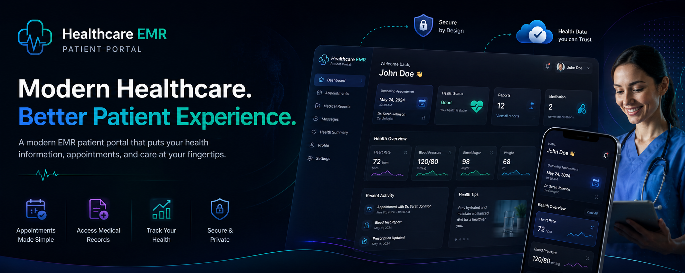
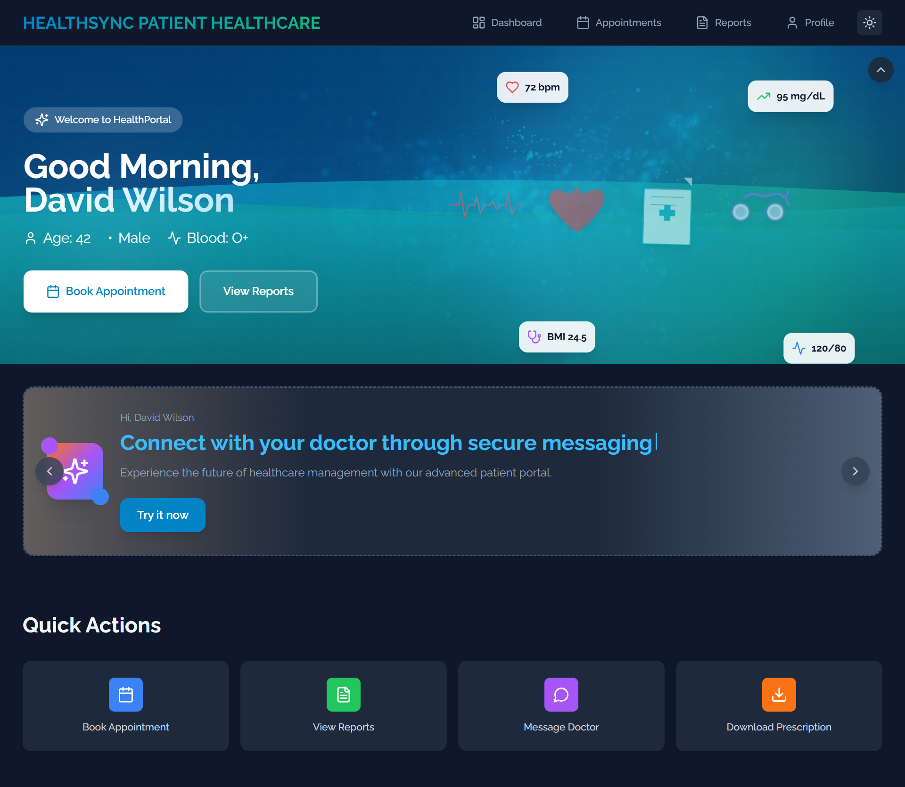
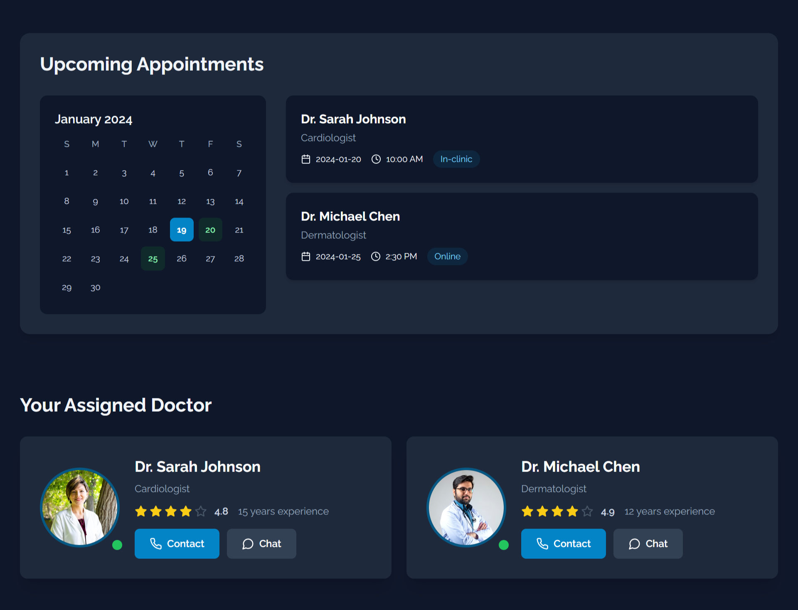
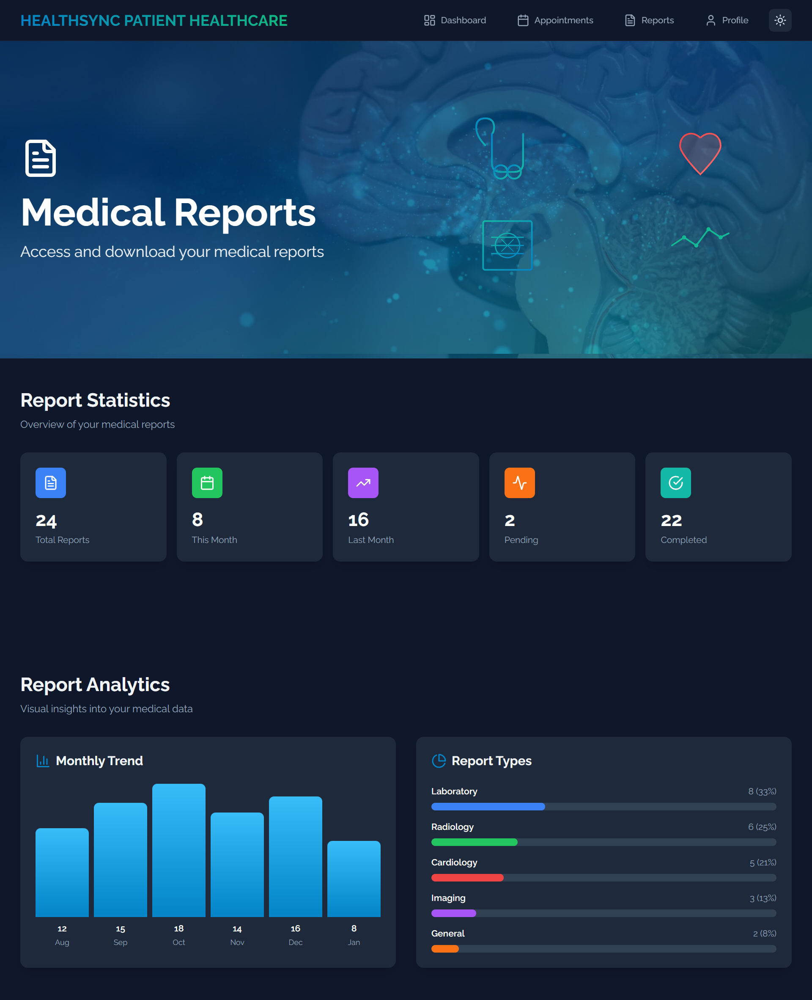
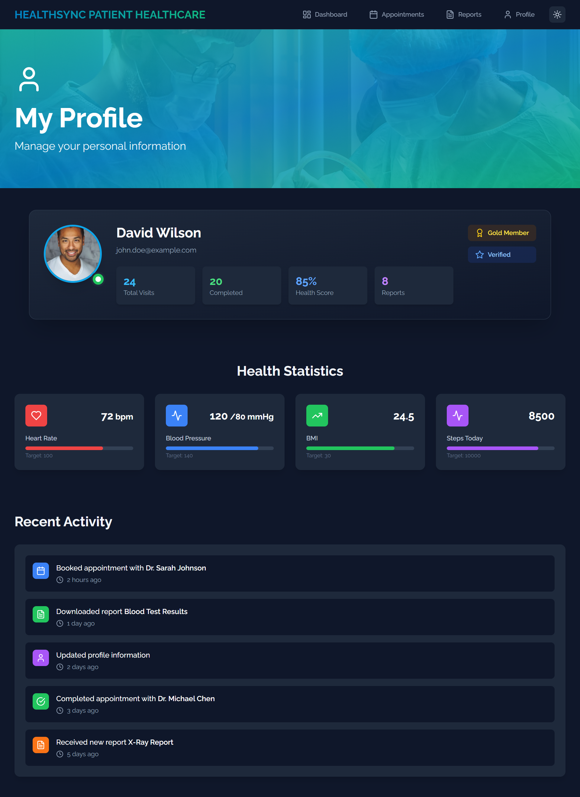

# 🏥 Healthcare EMR Patient Portal


Modern healthcare patient portal designed to deliver seamless patient engagement, appointment management, medical record access, and digital healthcare experiences through an intuitive and responsive interface.

---

<p align="center">
  
</p>

---

## 🌐 Live Platform

🌐 https://phr.shivamitconsultancy.com/

---

# Platform Overview

Healthcare EMR Patient Portal is a modern digital healthcare platform designed to improve patient experiences through intuitive healthcare workflows, responsive interfaces, and streamlined access to healthcare services.

The platform centralizes patient interactions including appointment scheduling, medical records access, healthcare reporting, and profile management into a unified healthcare experience.

Designed with a patient-first approach, the platform focuses on accessibility, engagement, usability, and modern healthcare user experiences.

---

# Business Challenge

Traditional patient portals often suffer from:

- Poor user experience
- Limited mobile accessibility
- Fragmented healthcare workflows
- Difficult navigation
- Low patient engagement
- Inconsistent healthcare experiences

Healthcare organizations require modern digital platforms that improve accessibility, patient satisfaction, and healthcare interactions.

---

# Solution

The Healthcare EMR Patient Portal provides:

- Centralized patient dashboard
- Appointment scheduling workflows
- Medical records access
- Healthcare reporting experience
- Profile management system
- Responsive healthcare interface
- Modern healthcare engagement workflows

The platform enables healthcare organizations to deliver seamless digital healthcare experiences across desktop and mobile devices.

---

# Platform Focus Areas

- Patient Engagement
- Appointment Management
- Medical Records Access
- Healthcare Analytics
- Patient Profile Management
- Digital Healthcare Experience
- Responsive Healthcare UI

---

# Platform Highlights

- Patient-first healthcare experience
- Appointment booking workflows
- Medical records access
- Interactive healthcare dashboards
- Responsive design architecture
- Dark & light mode support
- Healthcare analytics visualizations
- Modern UI/UX patterns
- Advanced animation experiences
- Mobile-friendly healthcare platform

---

# Core Features

## 🏠 Patient Dashboard

- Personalized healthcare dashboard
- Health KPI monitoring
- Healthcare analytics
- Upcoming appointments
- Doctor information
- Notifications and alerts

---

## 📅 Appointment Management

- Interactive calendar scheduling
- Available slot selection
- Appointment booking workflows
- Doctor availability tracking
- Appointment history

---

## 📋 Medical Reports

- Medical reports access
- Healthcare document management
- Report download workflows
- Healthcare analytics views
- DICOM viewer experience

---

## 👤 Patient Profile

- Personal information management
- Preferences configuration
- Account settings
- Healthcare profile management

---

# Patient Journey

```text
Patient Login
    ↓
Patient Dashboard
    ↓
Appointment Scheduling
    ↓
Medical Reports Access
    ↓
Profile & Healthcare Management
```

---

# Technology Stack

## Frontend Engineering

- Next.js 14
- React 18
- TypeScript
- Tailwind CSS
- Framer Motion
- GSAP
- ScrollTrigger
- Lottie
- Lucide React

---

# System Architecture

The platform follows a modular healthcare architecture focused on patient engagement and digital healthcare experiences.

<p align="center">
  
</p>

---

# Platform Screenshots

## 🏠 Patient Dashboard

<p align="center">
  
</p>

---

## 📅 Appointment Management

<p align="center">
  
</p>

---

## 👨‍⚕️ Healthcare Engagement

<p align="center">
  
</p>

---

## 📋 Medical Reports

<p align="center">
  
</p>

---

## 👤 Patient Profile

<p align="center">
  
</p>

---

# Security Considerations

The platform incorporates modern security practices including:

- Secure authentication workflows
- Protected healthcare interactions
- Secure API integrations
- Session management architecture
- Privacy-focused user experiences

---

# Scalability

The platform is designed using scalable frontend architecture principles:

- Component-driven architecture
- Reusable healthcare UI system
- Modular feature organization
- Optimized rendering workflows
- Responsive healthcare experiences

---

# Deployment Infrastructure

- Vercel Deployment
- Production-ready frontend architecture
- Responsive web experience
- Optimized asset delivery
- Modern deployment workflows

---

# Future Roadmap

### Phase 1 — Patient Experience

- Dashboard enhancements
- Appointment workflows
- Healthcare reporting

### Phase 2 — Healthcare Services

- Telemedicine integration
- Prescription management
- Notifications system

### Phase 3 — AI Healthcare Layer

- AI Health Assistant
- Intelligent appointment assistance
- Healthcare recommendations
- Patient support automation

---

# Repository Structure

```txt
assets/
├── architecture/
├── branding/
├── screenshots/
└── workflows/
```

---

# Why This Platform Exists

Many patient portals provide fragmented healthcare experiences that make it difficult for patients to manage appointments, access medical records, and track healthcare activities.

Healthcare EMR Patient Portal demonstrates a modern patient-centric healthcare experience focused on accessibility, engagement, and seamless healthcare interactions.

---

# Engineering Vision

Healthcare EMR Patient Portal represents a modern approach to patient engagement and digital healthcare experiences.

The platform focuses on improving accessibility, healthcare interactions, patient satisfaction, and digital healthcare delivery through modern user experience design and scalable frontend architecture.

---

# 📄 License

MIT License

Copyright © 2026 SHIVAM ITCS
